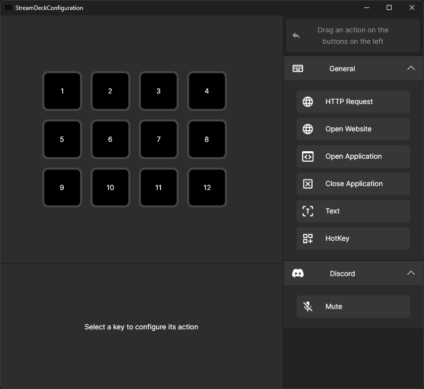

# 🎛️ StreamControlDeckConfiguration

**StreamControlDeckConfiguration** is a powerful custom Stream Deck–style desktop interface built with Avalonia UI (.NET 8).  
It allows you to assign and trigger actions like opening apps, sending HTTP requests, or controlling Discord – all from a virtual or physical button grid.

---

## ✨ Features

- 🔘 Virtual Stream Control Deck with configurable buttons (12 by default)
- 🌐 Perform **HTTP Requests** via GET/POST
- 🌍 **Open websites** or launch/close applications
- 📝 Send **custom text** to any focused application
- ⌨️ Trigger **global hotkeys**
- 🔊 (Planned) **Toggle Discord mute/unmute**
- 🎥 (Planned) Toggle **camera on/off** in Discord
- 🔉 (Planned) Use **Discord Soundboard** via shortcut or IPC

- ## 📸 Preview

  

